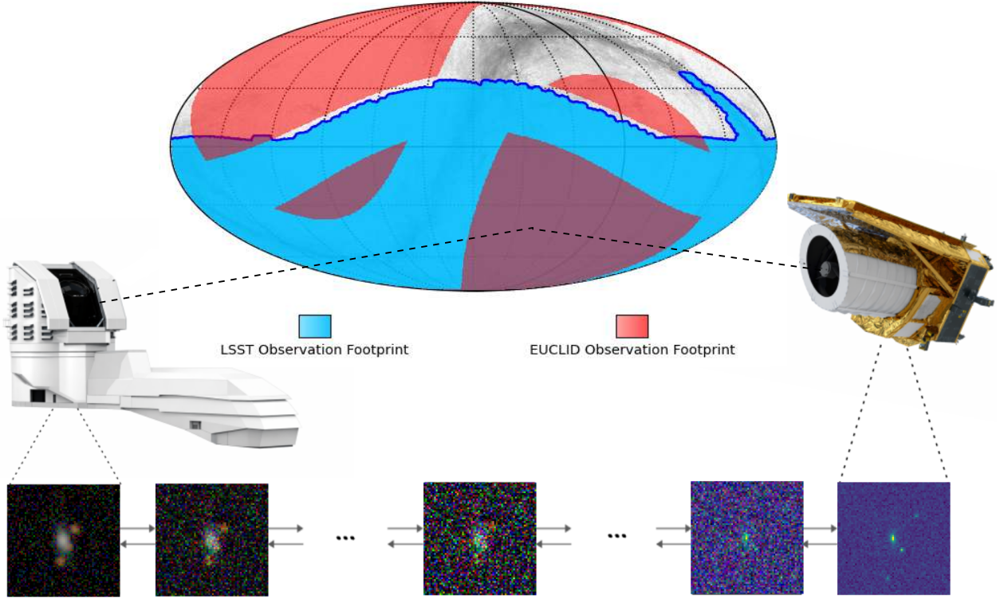
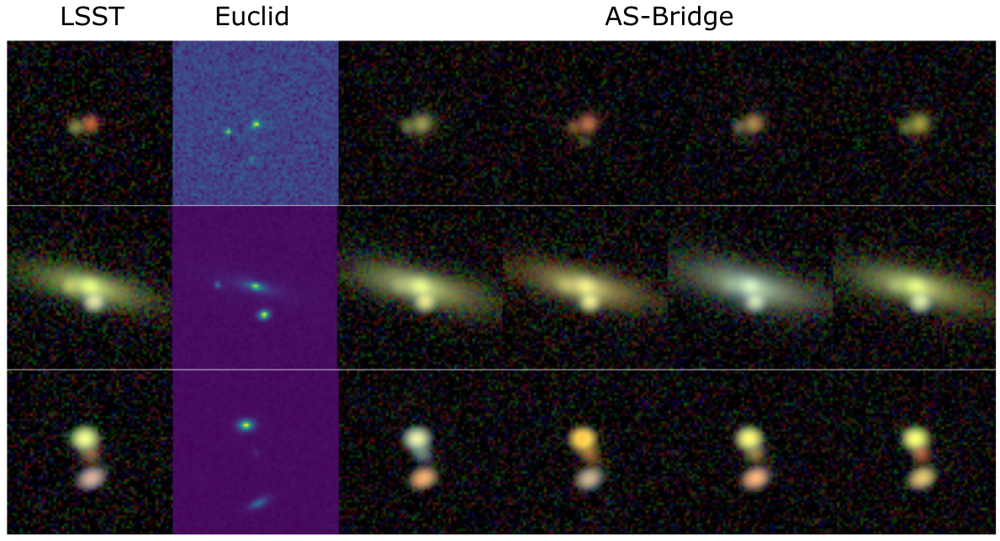
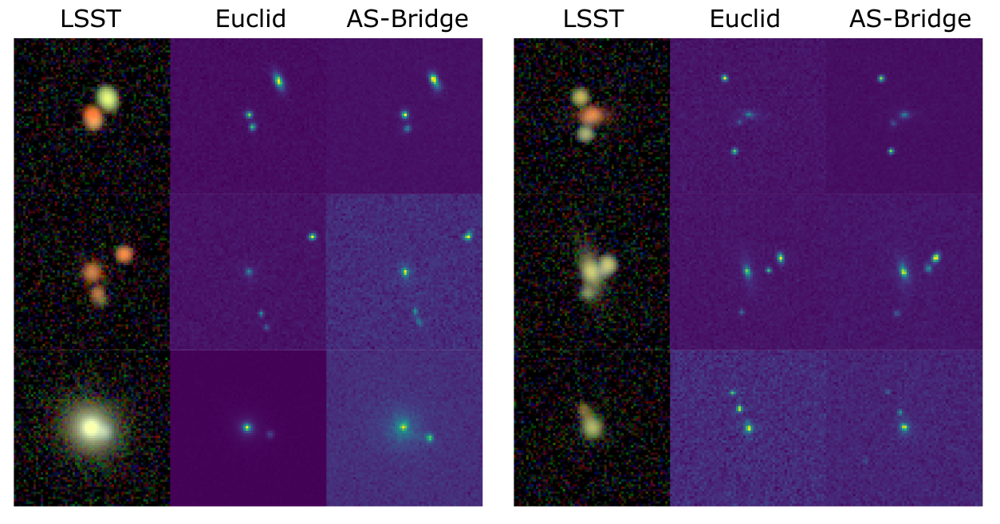
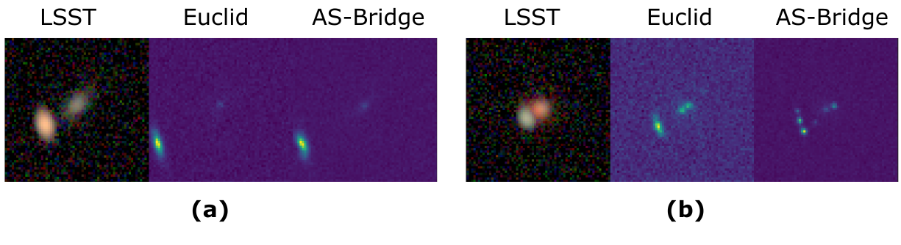

# AS-Bridge: a Bidirectional Generative Framework Bridging Next-generation Astronomical Surveys

Official code and dataset for **AS-Bridge**, a Bidirectional Generative Framework Bridging Next-generation Astronomical Surveys.

---

## Overview



AS-Bridge models the stochastic relationship between observations from the ground-based **LSST** and the space-based **Euclid** surveys.
It enables:

- Probabilistic reconstruction across surveys
- Cross-survey analysis under uncertainty
- Rare-event detection in large astronomical datasets

---

## Qualitative Results

### Euclid → LSST translation


### LSST → Euclid translation


### Complex and rare-event examples


AS-Bridge produces diverse yet physically consistent reconstructions, capturing both morphology and plausible color distributions.

---

## Data and Weights

[Train/test data and pretrained weights](https://drive.google.com/drive/folders/1r57M74BhZAf1o2SMkgYpreC2fT0-vwU1?usp=drive_link)

---

## Repository Layout
- `scirpts/train.py`: training
- `scirpts/eval_energy_scores.py`: energy score evaluation
- `scirpts/eval_anomaly_scores.py`: anomaly score evaluation
- `scirpts/calculate_energy_score.py`: score from saved predictions
- `scirpts/config.yaml`: default config
- `scirpts/inference.ipynb`: qualitative inference
- `scirpts/plot_anomaly.ipynb`: anomaly plotting/metrics

## Install
```bash
python -m venv .venv
source .venv/bin/activate
pip install -r requirements.txt
```


## Train
```bash
CUDA_VISIBLE_DEVICES=0 python scirpts/train.py \
  --config scirpts/config.yaml
```


## Evaluate Energy Score
```bash
CUDA_VISIBLE_DEVICES=0 python scirpts/eval_energy_scores.py \
  --config scirpts/config_eps_mse_shared.yaml \
  --checkpoint ckpt/eps/last.pth \
  --input-zarr /path/to/nonlens.zarr \
  --direction 0 \
  --num-generations 5 \
  --num-sampling-steps 200 \
  --output-dir metrics/energy_scores/shared/0 \
  --save-ids
```

## Evaluate Anomaly Scores
```bash
CUDA_VISIBLE_DEVICES=0 python scirpts/eval_anomaly_scores.py \
  --config scirpts/config_eps_mse_shared.yaml \
  --checkpoint ckpt/eps/last.pth \
  --lens-zarr /path/to/lens.zarr \
  --nonlens-zarr /path/to/nonlens.zarr \
  --direction 1 \
  --start-t 200 --sample-steps 40 --num-candidates 5 \
  --output-dir metrics/anomaly_scores/shared/dir1 \
  --save-ids
```
